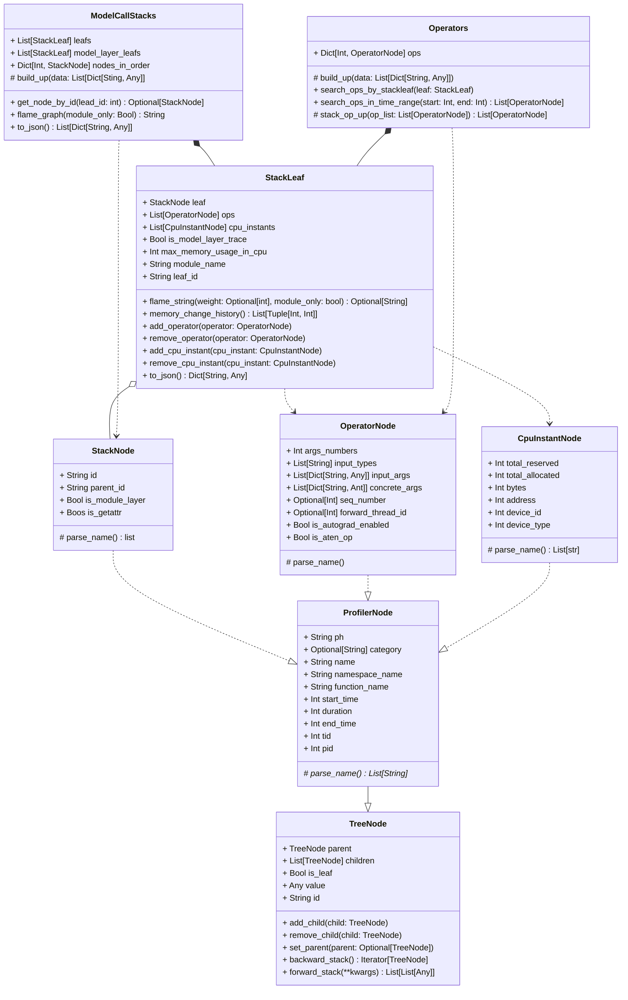

# UML Diagram

```mermaid
classDiagram
	ProfilerNode --|> TreeNode
	StackNode ..|> ProfilerNode
	OperatorNode ..|> ProfilerNode
	CpuInstantNode ..|> ProfilerNode
	StackLeaf o-- StackNode
	StackLeaf ..> OperatorNode
	StackLeaf ..> CpuInstantNode
	ModelCallStacks *-- StackLeaf
	ModelCallStacks ..> StackNode
	Operators *-- StackLeaf
	Operators ..> OperatorNode

	class TreeNode{
		+ TreeNode parent
		+ List[TreeNode] children
		+ Bool is_leaf
		+ Any value
		+ String id
		+ add_child(child: TreeNode)
		+ remove_child(child: TreeNode)
		+ set_parent(parent: Optional[TreeNode])
		+ backward_stack() Iterator[TreeNode]
		+ forward_stack(**kwargs) List[List[Any]]
	}
	class ProfilerNode{
		+ String ph
		+ Optional[String] category
		+ String name
		+ String namespace_name
		+ String function_name
		+ Int start_time
		+ Int duration
		+ Int end_time
		+ Int tid
		+ Int pid
		# parse_name() List[String]*
	}
	class StackNode{
		+ String id
		+ String parent_id
		+ Bool is_module_layer
		+ Boos is_getattr
		# parse_name() list
	}
	class OperatorNode{
		+ Int args_numbers
		+ List[String] input_types
		+ List[Dict[String, Any]] input_args
		+ List[Dict[String, Ant]] concrete_args
		+ Optional[Int] seq_number
		+ Optional[Int] forward_thread_id
		+ Bool is_autograd_enabled
		+ Bool is_aten_op
		# parse_name()
	}
	class CpuInstantNode{
		+ Int total_reserved
		+ Int total_allocated
		+ Int bytes
		+ Int address
		+ Int device_id
		+ Int device_type
		# parse_name() List[str]
	}
	class StackLeaf{
		+ StackNode leaf
		+ List[OperatorNode] ops
		+ List[CpuInstantNode] cpu_instants
		+ Bool is_model_layer_trace
		+ Int max_memory_usage_in_cpu
		+ String module_name
		+ String leaf_id
		+ flame_string(weight: Optional[int], module_only: bool) Optional[String]
		+ memory_change_history() List[Tuple[Int, Int]]
		+ add_operator(operator: OperatorNode)
		+ remove_operator(operator: OperatorNode)
		+ add_cpu_instant(cpu_instant: CpuInstantNode)
		+ remove_cpu_instant(cpu_instant: CpuInstantNode)
		+ to_json() Dict[String, Any]
	}
	class ModelCallStacks{
		+ List[StackLeaf] leafs
		+ List[StackLeaf] model_layer_leafs
		+ Dict[Int, StackNode] nodes_in_order
		# build_up(data: List[Dict[Sting, Any]]
		+ get_node_by_id(lead_id: int) Optional[StackNode]
		+ flame_graph(module_only: Bool) String
		+ to_json() List[Dict[String, Any]]
	}
	class Operators{
		+ Dict[Int, OperatorNode] ops
		# build_up(data: List[Dict[String, Any]])
		+ search_ops_by_stackleaf(leaf: StackLeaf)
		+ search_ops_in_time_range(start: Int, end: Int) List[OperatorNode]
		# stack_op_up(op_list: List[OperatorNode]) List[OperatorNode]
	}
```
